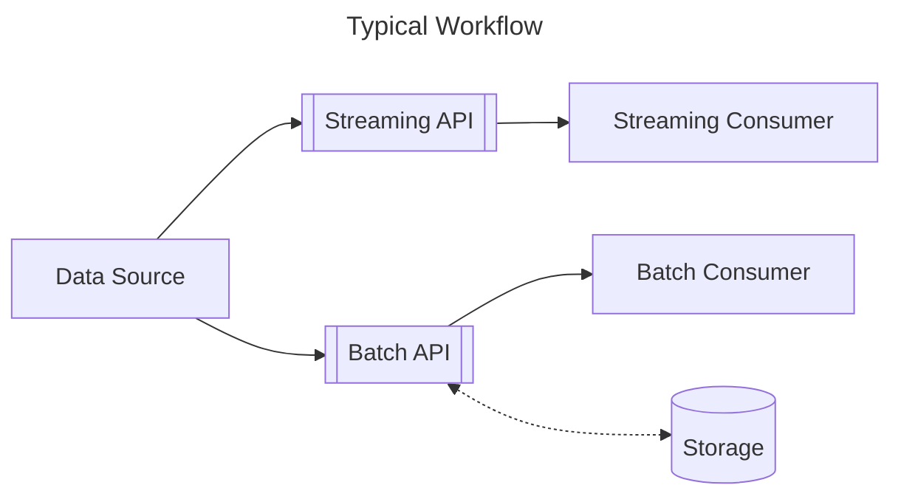
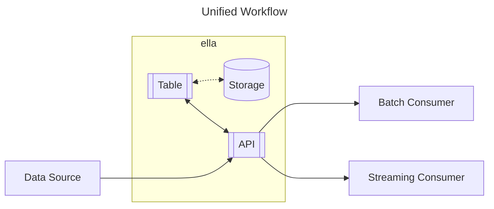

# ella: Embedded Low-Latency dAtastore

**ella is in extremely early development. There is very little documentation and many parts of it do not work. Expect that any part of the API may change in the future.**

ella is a streaming time-series datastore designed for:

- Low (<1 ms) end-to-end latency.
- First-class multidimensional tensor support.
- Hybrid embedded/client-server deployment.

ella is **not**:

- An ACID database.
- A replacement for Delta Lake, Snowflake, or any other cloud data service.

## Use Cases

The goal of ella is to simplify the storage and analysis of data in systems that require low-latency data access.

A typical workflow for such a system might be something like:
1. Data is ingested from sensors.
2. The data is sent to streaming consumers using a low-latency API (e.g. gRPC, LSL).
3. The data is written to persistent storage such as a SQL database or an HDF5 file.
4. Batch consumers read data from persistent storage using a separate API.



In contrast, ella provides a unified API for both streaming and batch processing:



For example, consider the following queries:

```sql
-- Get all rows from the table
SELECT time,x,y FROM sensor

-- Only return new rows published after this query is executed
SELECT time,x,y FROM sensor WHERE time > now()

-- Return existing rows, but ignore any additional rows published after the query is executed
SELECT time,x,y FROM sensor WHERE time < now()
```

## Concepts
### Tables

Data in ella is grouped into *tables*. Each table is either a *topic* or a *view*.

- **Topics:** collect rows of data written by publishers. Topics are stored to disk by default, but *temporary* topics are not.
- **Views:** return the result of specific queries. By default a view is re-computed each time it's scanned, but views can also be *materialized* to disk. Views are read-only.

### Organization

ella follows the *Catalog → Schema → Table* organizational model.

The default catalog is `"ella"` and the default schema is `"public"`.
